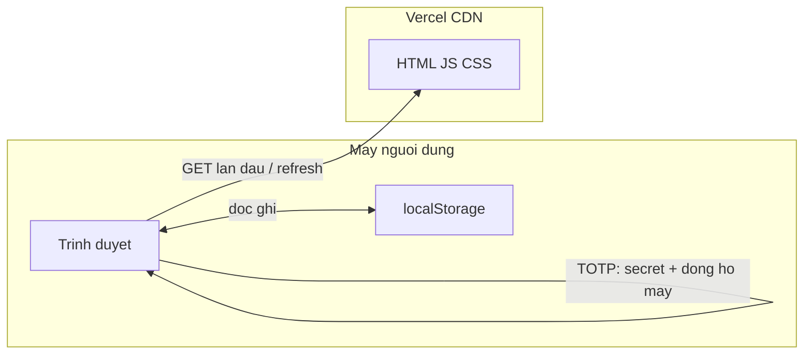

# Hoạt động và kiến trúc ứng dụng Authenticator (TOTP)

Tài liệu mô tả **app này làm gì**, **dữ liệu đi đâu**, **vì sao dùng chung secret với Google Authenticator**, và **deploy Vercel có chịu tải tốt không**.

---

## 1. App này làm gì (tóm tắt)

- Bạn nhập **secret** (chuỗi Base32 hoặc URL `otpauth://`) mà dịch vụ (Gmail, GitHub, ngân hàng, …) đã cấp khi bật 2FA.
- App **tính mã 6 số** thay đổi mỗi **30 giây** bằng cùng quy tắc chuẩn **TOTP** (RFC 6238).
- Có thể **lưu danh sách** secret trong **trình duyệt** (`localStorage`).

**Không có tài khoản đăng nhập, không có backend của riêng app này** trong phiên bản hiện tại.

---

## 2. App có gửi request tới bên nào không?

### Khi bạn dùng trang web (tạo mã, lưu danh sách)

| Hành động | Gửi request tới đâu? |
|-----------|----------------------|
| Tính mã TOTP | **Không.** Toàn bộ chạy trong JavaScript trên trình duyệt (thư viện `otplib`). |
| Lưu / đọc danh sách đã lưu | **Không ra internet.** Chỉ đọc/ghi **localStorage** trên máy bạn. |
| Mở trang lần đầu | **Có** — trình duyệt tải file tĩnh từ **Vercel (CDN)**: HTML, JS, CSS (giống mọi website tĩnh). |

**Kết luận:** Secret và mã OTP **không** được gửi lên server của bạn hay của Google khi bạn bấm “Tạo mã”. Chỉ có việc **tải trang** (và có thể font, favicon nếu có) là traffic tới host deploy.

### Lưu ý nhỏ

- Trình duyệt có thể gửi request phụ (analytics, extension) tùy môi trường — **không thuộc logic của repo này** nếu bạn không cài thêm công cụ đo lường.
- Nếu sau này bạn thêm API riêng, phần “không gửi secret” sẽ phụ thuộc code mới; **phiên bản hiện tại không có API đó.**

---

## 3. Tín hiệu / dữ liệu đi từ đâu tới đâu?

Sơ đồ đơn giản khi user đang dùng app trên Vercel:

Giải thích:

1. **Lần đầu mở site:** trình duyệt → Vercel → nhận bundle Vue/JS/CSS.
2. **Sau khi đã tải:** mọi thứ nhập secret, bấm “Tạo mã”, hiển thị mã — xảy ra **trong RAM của trình duyệt**, dùng **thời gian hệ thống** của máy user.
3. **Lưu danh sách:** chỉ giữa trình duyệt và **ổ đĩa/logic localStorage** (theo origin của domain deploy).

**Không có** luồng: “secret → server app → Google → trả mã”. Google Authenticator trên điện thoại cũng **không** gọi Google mỗi lần hiện mã; nó cũng chỉ tính local từ secret + thời gian.

---

## 4. Vì sao lại “tích hợp” / giống Google Authenticator?

Đây **không phải** tích hợp API OAuth hay đăng nhập Google.

**Google Authenticator** (và hầu hết app 2FA) tuân theo chuẩn mở:

- **RFC 6238** — TOTP (Time-based One-Time Password).
- Thường dùng **HMAC-SHA1**, bước thời gian **30 giây**, **6 chữ số**.
- Secret thường mã hóa **Base32**; QR / link dùng định dạng **`otpauth://`** để chứa secret và metadata.

App này dùng **cùng công thức toán học** và **cùng định dạng secret** → mã sinh ra **trùng** với Google Authenticator **nếu** cùng một secret và **đồng hồ** hai bên không lệch quá xa (thường vài giây là ổn).

**Không có** “tín hiệu” nào chạy giữa app web của bạn và máy chủ Google để lấy mã TOTP.

---

## 5. Các thành phần trong code (tham chiếu)

| Phần | Vai trò |
|------|---------|
| `parseOtpauth.js` | Đọc Base32 thuần hoặc parse URL `otpauth://` để lấy secret (và gợi ý tên). |
| `useTotp.js` | Gọi `otplib` `generateSync` theo chu kỳ + thanh tiến trình 30s. |
| `useSavedSecrets.js` | Đọc/ghi mảng tài khoản đã lưu trong `localStorage`. |

---

## 6. Deploy Vercel — có ổn định khi traffic tăng? Có “crash” không?

**Với kiểu deploy hiện tại (site tĩnh từ `dist/`):**

- Vercel phục vụ file qua **CDN / Edge**. Mỗi request chủ yếu là **tải file tĩnh** — không có process Node chạy liên tục cho logic TOTP của bạn.
- **Tăng traffic** thường chỉ là nhiều người **tải JS/HTML** hơn; hạ tầng Vercel **scale theo chiều ngang** cho static asset, **không phải** kiểu một server đơn bị quá tải CPU vì tính TOTP (vì TOTP chạy **trên máy client**).

**Không có “app server” của bạn để crash** vì quá nhiều người bấm “Tạo mã” — việc đó xảy ra trên trình duyệt từng người.

**Giới hạn / lưu ý thực tế:**

- Vẫn có **hạn mức fair use / billing** theo gói Vercel (bandwidth, build minutes). Với site cá nhân / nhỏ, thường rất dư.
- Nếu bạn thêm **Serverless Functions** hoặc API trong cùng project, phần đó mới có cold start / timeout / giới hạn concurrency — **hiện tại repo này không bắt buộc** phần đó cho chức năng TOTP.

**Tóm lại:** Với kiến trúc **frontend-only** như hiện tại, deploy Vercel **phù hợp và ổn định** khi traffic tăng; nguy cơ “crash server vì tính OTP” **không áp dụng** vì không có server tính OTP.

---

## 7. Mô tả repo (copy dùng cho GitHub / Vercel)

**Tiếng Anh (ngắn, phù hợp GitHub “About”):**

> Client-side TOTP authenticator built with Vue 3 and Vite. Generates 6-digit RFC 6238 codes compatible with Google Authenticator; secrets stay in the browser (localStorage). No backend required. Deployable as a static site on Vercel.

**Tiếng Việt:**

> Ứng dụng TOTP chạy hoàn toàn trên trình duyệt (Vue 3 + Vite). Sinh mã 6 số chuẩn RFC 6238, tương thích Google Authenticator; secret lưu localStorage, không backend. Deploy tĩnh lên Vercel.

**Một dòng siêu ngắn (English):**

> Vue + Vite web app: RFC 6238 TOTP codes in the browser, Google Authenticator–compatible, static deploy on Vercel.

---

## 8. Liên kết

- [README chính](../README.md) — cài đặt, build, CI/CD, deploy.
